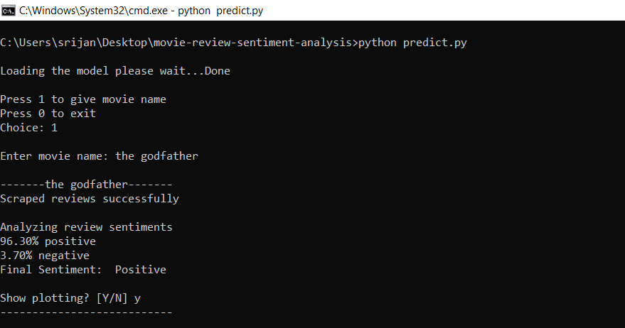
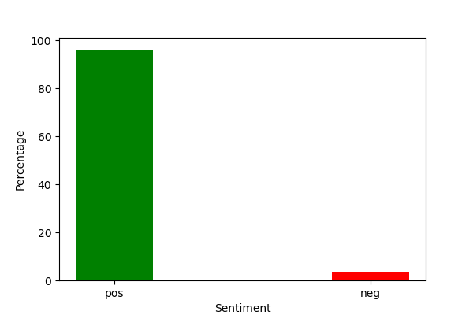
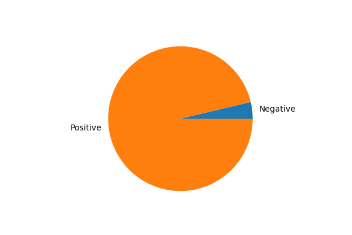

# [Movie Review Sentiment Analysis](https://mrsa.netlify.app/)

The program takes movie name as input then it scrapes the reviews from IMDB website and using the pretrained SVC model it predicts the sentiment of the reviews wheather it is positive or negative. After that it calculates the percentage of positive and negative reviews and upon compairing the two percentages it gives the final sentiment of that movie.

## Datasets

- [IMDB 50K Movie Reviews](https://www.kaggle.com/datasets/lakshmi25npathi/imdb-dataset-of-50k-movie-reviews)

- [IMDB Movie IDs](https://drive.google.com/drive/folders/1y9J99zxIV4jqE8e_Pp_p4R6oEARKkaXA?usp=sharing)

<!-- ## Screenshots

### Command-line-application





 -->

## Run Locally

The project has a `command-line-application` as well as a `webapp`.Below you can find the steps to run them both seperately.

### I. Run the "Command-line-application"

Clone the project

```bash
  git clone https://github.com/SrijanDas/movie-sentiment-analysis.git
```

Go to the project directory

```bash
  cd movie-sentiment-analysis
```

Go to the cmd-app directory

```bash
  cd command-line-application
```

Install dependencies

```bash
  pip install -r requirements.txt
```

Run the command-line program

```bash
  python predict.py
```

### II. Run the "Webapp"

For running the webapp we need to start the backend server as well as the client server.

Clone the project

```bash
  git clone https://github.com/SrijanDas/movie-sentiment-analysis.git
```

Go to the project directory

```bash
  cd movie-sentiment-analysis
```

Go to backend server directory

```bash
  cd server
```

Install dependencies

```bash
  pip install -r requirements.txt
```

Run the backend-server

```bash
  python app.py
```

Now the backend server should be running on `http://localhost:5000/` and we are all ready to setup the client server.

To run the client server navigate to the `movie-sentiment-analysis\client` folder and run the following commands.

Install dependencies

```bash
  npm install
```

Run the client-server

```bash
  npm start
```

That's it. The client server should now be running on `http://localhost:3000`

## Thank you 😃

[](https://srijan-das.web.app/)
[](https://www.linkedin.com/in/srijan-das-3591791b3)
[](https://twitter.com/Srijan_1805)
